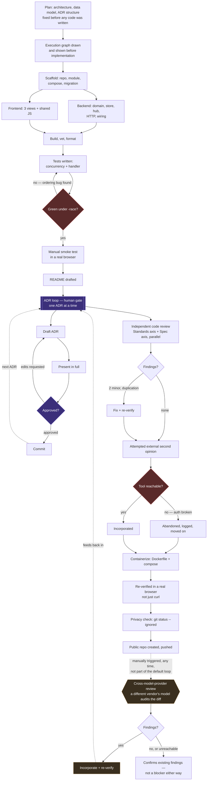

# How this was built: an AI-agent workflow

This repo wasn't produced by pasting a spec into a chat window and accepting whatever came
back. It was built through a structured workflow: a plan fixed before any code, an execution
graph drawn before implementation, decisions gated on human review, and an independent pass
checking the result before calling it done. This page shows that process, not just the output.

## The execution graph

Two things worth reading closely, because they're the point:

- **The back-edges are real, not decorative.** The tests loop caught a genuine ordering bug (a
  test truncated its database tables before migrations had created them). The ADR loop's edit
  cycle isn't a formality — every one of the four ADRs in this repo went through at least one
  real revision before being approved.
- **The "abandoned" branch stayed in the graph.** An attempt to get an independent review from a
  second model failed on a broken auth session in the tool, was retried twice, and was then
  deliberately dropped rather than forced. A workflow that only shows the parts that worked isn't
  showing the workflow.
- **The cross-model-provider review at the end is a standing capability, not that one attempt.**
  It's drawn separately from the failed attempt above and marked manually triggered because that's
  what it is: not a stage the pipeline runs on its own, but a second opinion from a different
  vendor's model, invoked on request, at whatever point it's wanted — including, as it happened
  here, after everything else was already done and shipped.

## What the graph is actually demonstrating

**Plan before code, not code then plan.** The architecture, data model, and even the *structure*
ADRs would take were fixed in writing before implementation started. The execution graph itself
was presented and could have been corrected before a single file was touched.

**Parallel work only where it's genuinely safe.** The backend and frontend were built
concurrently by different workers because they touch disjoint files and share a frozen API
contract — not because parallelism is impressive. Nothing else in this build was parallelized;
most of it is too interdependent to split safely.

**Every architectural decision is human-gated, not just human-visible.** Four ADRs, each drafted,
presented in full, and revised — sometimes more than once — before being committed. Nothing was
accepted on a first draft. One ADR was restructured entirely mid-review after a spotted flaw in
how it grouped two orthogonal decisions.

**An independent reviewer, not just self-review.** A separate pass audited the finished code
against its own documentation before it was called done, and found two real (if minor) issues
that got fixed and re-verified — the model checking its own work is a weaker signal than a
second, differently-motivated pass finding something.

**Cross-model-provider review is available, not automatic.** The review above stays within one
model family — a second, same-provider pass auditing the first. A different vendor's model
auditing the same diff is a genuinely different kind of check, but it's a manually triggered one:
invoked when a second, independently-trained opinion is specifically wanted, not run by default
on every change. Tool reliability across providers also varies enough in practice that forcing it
into the automatic path would make the automatic path only as reliable as its flakiest dependency.

**Correctness claims are checked, not assumed.** "It builds" and "the tests pass" were verified
by actually running them, repeatedly, including through a full container rebuild. A claim that a
containerized app worked based only on `curl` from inside the container was treated as
insufficient until it was confirmed in an actual browser.

**A written decision record, not a memory of one.** Every point where a human decision changed
the direction of the build — not just approved it — is logged as it happened, in the same shape
every time: what was proposed, what was chosen, and whether that was an override or an original
call nobody had offered as an option.
